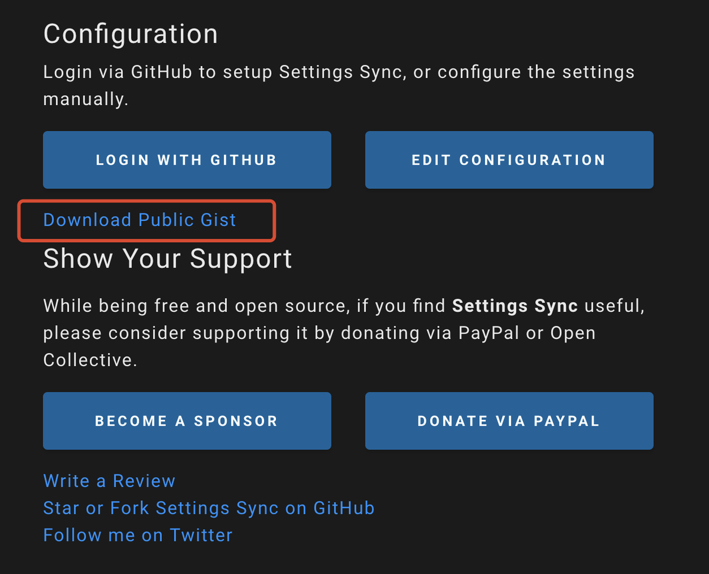
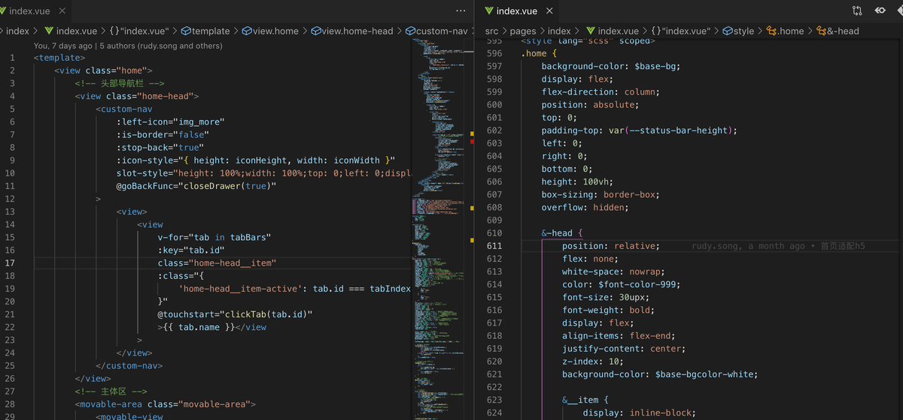
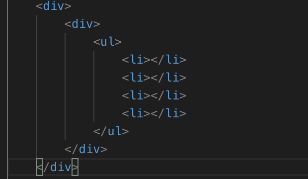
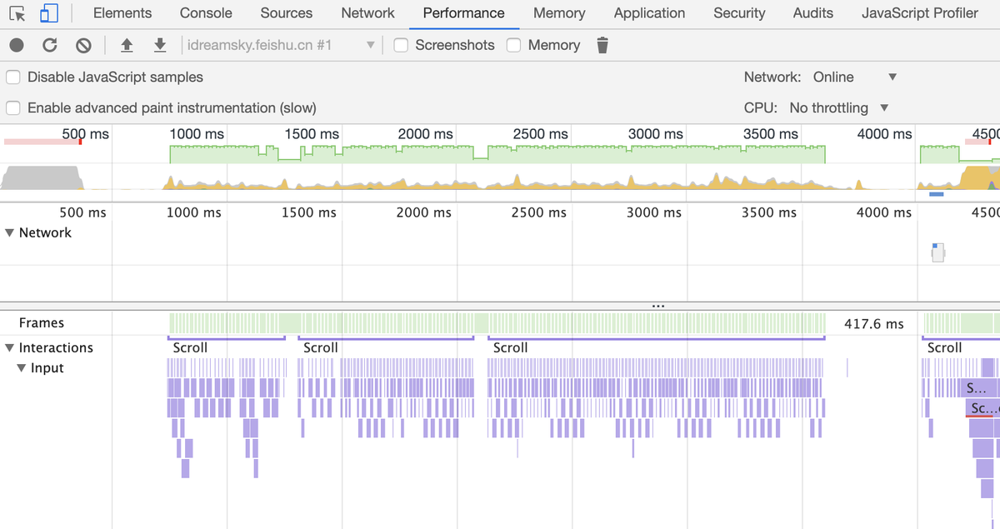

# 前端效率工程

不会偷懒的程序员不是好程序员，如何做到即保证工作质量和效率，又能偷懒呢

这是我一直在思考的话题，我认为也是每个有追求的程序员的必修课

我的目标是提高前端开发效率，减少不必要的时间浪费，降低工作时间

## 核心思想

-   少写代码，特别是不重要的重复代码

-   避免出错，提前检测错误，减少后面把时间花在解 bug 上

-   规范格式，避免冲突，并且使代码整洁

-   开发过程工具化，减少重复劳动和易出错的地方（容易忘记修改的地方）

-   高效调试，知道如何快速定位问题

那如何做到上述，让我们从开发的过程中逐步分析

> 工欲善其事，必先利其器
> 磨刀不误砍柴工

## 工具篇：vscode

vscode 是非常好用的开发工具，很多同学喜欢，但也有很多同学不够熟悉，特别是快捷键，用好能大大提高开发效率，是不是看到别人写代码如开挂一般，而自己还在 ctrl + c ctrl + v，学会这些快捷键，你也能开挂

下面开发中列举一些常用的快捷键

**vscode 常用效率快捷键：**

| 描述                  |                               mac |             window             |
| --------------------- | --------------------------------: | :----------------------------: |
| 打开文件              |                       command + p |            ctrl + p            |
| 删除一个单词          |                   option + delete |         ctrl + delete          |
| 返回上次位置          | control + - / control + shift + - |  ctrl + - / ctrl + shift + -   |
| 文件内搜索内容        |                       command + F |            ctrl + F            |
| 文件内替换            |                                无 |            ctrl + H            |
| 全文搜索内容          |               command + shift + F |        ctrl + shift + F        |
| 当前行上移/下移       |                    option + ↑ / ↓ |          alt + ↑ / ↓           |
| 复制当前行在上方/下方 |             option+ shift + ↑ / ↓ |      alt + shift + ↑ / ↓       |
| 删除当前行            |                       command + x |            ctrl + x            |
| 合并当前行            |                       control + J |               无               |
| 以单词为单位移动      |                    option + ← / → |          ctrl + ← / →          |
| 移到行首/行尾         |                   command + ← / → |           home / end           |
| 选中一行              |           command + shift + ← / → |      ctrl + shift + ← / →      |
| 选中块                |     command + shift + control + → |     ctrl + shift + alt + →     |
| 选中同样的内容        |                       command + D |            ctrl + D            |
| 选中同样的全部内容    |               command + shift + L |           ctrl + F2            |
| 侧边栏开关            |                       command + B |            ctrl + B            |
| 控制台开关            |                       command + J |            ctrl + J            |
| 快速定位行数          |                       command + G |            ctrl + G            |
| 行缩进                |                   command + [ / ] |          ctrl + [ / ]          |
| 多光标                |                     option + 光标 |           alt + 光标           |
| 文件查找类或方法      |  command + P + @ / cm + shift + O | ctrl + P + @ / ctrl + shift +O |
| 帮助                  |                  command + p + ？ |         ctrl + p + ？          |

不好记？多用！如果忘记，可以通过 keyboard shortcuts 查询


**快捷键总结：**

optiona/alt 一般用来“单词”操作

command/ctrl 一般执行“整行”操作

shift 一般选中，复制，全部之类的

## 插件篇

vscode 有很多好用的插件，这里我以 vue 开发，列举一些提升效率相关的插件

插件可以通过商店搜索名称获得

必选：

-   Vetur：Vue 单文件格式化，代码提示插件

-   ESLint：代码检查工具

-   Prettier：代码格式化插件

推荐：

-   GitLens：git 提示工具

-   Bracket Pair Colorizer：对齐提示工具

-   Auto Close Tag：自动关闭标签

-   Turbo Console Log：日志工具

-   Vue Peek：Vue 组件查看器

-   Import Cost：查看导入包体大小

-   Vue 2 Snippets：Vue 代码模板，代码提示

可选：

-   VueHelper：vue 代码提示

-   HTML CSS Support：增强的 css 提示工具，缺陷是增加很多无用提示

> 这里只是列出一部分，更多好用插件团队可以根据自身需求配置

部分插件自定义配置：

```
{
    "git.autofetch": true,
    "eslint.alwaysShowStatus": true,
    "eslint.autoFixOnSave": true,
    "eslint.validate": [
        "javascript",
        "javascriptreact",
        {
            "language": "vue",
            "autoFix": true
        },
        {
            "language": "typescript",
            "autoFix": true
        },
        {
            "language": "typescriptreact",
            "autoFix": true
        }
    ],
    "editor.formatOnSave": true,
    "vetur.format.defaultFormatter.html": "prettier",
    "prettier.tabWidth": 4,
    "[javascript]": {
        "editor.defaultFormatter": "esbenp.prettier-vscode"
    },
    "[typescript]": {
        "editor.defaultFormatter": "esbenp.prettier-vscode"
    },
    "[jsonc]": {
        "editor.defaultFormatter": "esbenp.prettier-vscode"
    },
    "[html]": {
        "editor.defaultFormatter": "esbenp.prettier-vscode"
    }
}
```

**团队插件管理**

如果是团队使用，可能需要大家插件是统一的，不能为每个人单独按照一下吧，这里推荐使用 vscode 插件管理器工具：Settings Sync，通过他大家可以协同开发的插件环境

我自己也配置了一个 Settings Sync，不必手动安装及设置，通过下面工具一键配置，达到团队环境一致化

1. 下载 vscode 插件：Settings Sync

2. 使用快捷键 Shift + Alt + D 打开设置界面
   或者 Ctrl + Shift + P 输入 Sync:Download Settings

3. 选择 Download publish gist
   

4. 输入下面代码，然后等待完成
   1a71745a5df4337f404e3e67c71e1a1f

> 由于工作关系，上面配置不会经常更新，只是用来作为示例

## ESLint

eslint 是前端必配的利器，对代码一致性，规范性，以及潜在问题检查上，非常有帮助，配置主要从以下方面考虑：

-   配置思想：兼顾效率，效果

-   包含：vue，ts，css 代码检查，发现潜在错误

-   增加自定义规则，避免一些代码的坑

-   包含代码格式化检查

## Prettier

prettier 我也建议必备，统一代码格式化工具，保存即自动格式化，对代码美化，减少 git 冲突有着重要意义

-   统一代码格式化，减少冲突

-   保存自动格式化

**插件有用的 vscode 快捷键：**

```
查看正在运行插件

Ctrl + Shift + P 并输入 Show running extensions

查看启动性能
Ctrl + Shift + P 并输入 Startup Performance
```

## css 代码开发效率

在 vscode 内，可以使用 css 简写，快速书写 css 代码，也能减少书写代码的数量，比如：

```
p10 -> padding: 10px;

pl10 -> padding-left: 10px; 其他三个方向只要把 l 改成 top 的 t ，

right 的 r，bottom 的 b 即可

m10 ->margin:10px;

ml10 -> margin-left: 10px;

t10 -> top: 10px;

f10 -> font: 10px;

fw500 ->font-weight: 500;

h10px -> height: 10px;

w10 -> width: 10px;
```

## 分屏功能

vscode 有分屏功能，对于比较长的 vue 或者 html 页面，可以分两屏，第一屏看上面部分，第二屏看下面部分，这样不会上下来回滚动查看，从而节省时间，提高效率。



几个常用的快捷键

```
分屏
ctrl + |

关闭
ctrl + W

恢复关闭
ctrl + Shift + T

左侧边栏
ctrl + B

下侧边栏
ctrl + J

终端
ctrl + ~
```

## 代码片段

代码片段可以通过几个字符，打出一些复杂的固定的代码，甚至可以自己定义一些重复的代码模板，减少敲打代码工作量，轻松写一些复杂代码。

vscode 内自定义代码片段

`快捷键：ctrl+shift + p > snippet`


**snippet 结构：**

key 片段名字

prefix： 前缀，输入的触发条件，比如上面例子中当我输入 log 后，就能 log 代码片段

description： 说明，片段的具体描述

body： 主体部分，在里面根据语法定义自己需要的代码片段

在 body 中，使用转义字符\来书写制表符 Tab、双引号"等内容

使用\${num: default name}来定义输入位置，按下 Tab 键来递进光标到下一个

\$num 的值为 0,1,2,3...。0 为光标的最终位置，1,2,3...决定了光标的顺序位置

default name： 是默认值，可按下 Tab 不编辑直接跳过

比如下面我自定义的 log 模板


参考网站：
https://snippet-generator.app

更多参考：
https://juejin.im/post/5d0496415188257fff23b077
https://code.visualstudio.com/docs/editor/userdefinedsnippets

## emmet 功能

emmet 对于提升书写 html 的效率非常有帮助，vscode 也支持 emmet 功能，

比如下面写法：

`div>div>ul>li\*4`

最终结果如下，也大大减少了代码书写的数量：



参考资料
https://www.cnblogs.com/summit7ca/p/6944215.html

## 前端语言的选择：TypeScript，ES7

老的基于 function 的 js 写法，有很多弊端，比如没有类型，缺少面向对象一些写法，随着 es6，7 的普及，这块短板有所增强，建议使用 es7 的高级写法，比如 class，await 等。
如果大型项目，推荐使用 ts，ts 相比 es7 又增加了不少语法糖，对团队协作，代码重构都是非常有帮助的。

ts 的优势：

-   强类型，减少类型错误

-   面向对象，让代码看起来更优雅

-   有很方便的重构方式，易于维护和重构

# 工具化：前后端消息管理系统

大型项目，经常会前后端分开开发，前端负责显示和交互，后端负责逻辑和存储，前后端通过消息协议交互，这里就面临一个前后端沟通和同步的问题。经常会有这样的情况，

1. 前端等后端接口实现，导致前端进度拖慢

2. 后端更改接口，导致前端也要响应的更改，并且容易改错

3. 消息经常采用 json 结构，使用的时候无代码提示，字段易写错，导致潜在 bug

如何解决这些问题，提高前后端配合的效率呢？

这样就需要一个消息的管理系统，有一个 web 系统管理消息定义，进行数据模拟

这里推荐 YAPI(https://github.com/ymfe/yapi)，他们实现了消息定义和数据 mock 功能，我们在此基础上，又增加了自定义的代码生成功能，通过消息协议直接生成消息类，能够一次性生成所有消息交互过程，增强代码提示，对开发效率和减少潜在错误提供帮助很大。

类似工具主要基于以下方面考虑：

-   前后端分别开发，减少相互不依赖，相互等待

-   接口定义工具化，可视化，随时可修改，能够形成文档

-   可模拟消息数据，在服务器未完成之前进行开发测试

-   可以自动生成代码，减少手误

-   可自动化测试服务器接口

## 工具化：自动化部署

随着多端开发以及工程原来越大，构建会变的时间越来越长和复杂化，同时产品和 QA 同学也有检查自己构建的需求，所以自动化构建工具就显得尤其重要，通过 jenkins 或 teamctiy 能轻松实现自定义构建流程，基于可视化管理界面，小白都能使用。我们还同时打通了自己办公用的 Im 通信，如果有新的构建，会以机器人的形式通知给大家，上线环境自动切换，也大大减少手动的工作量，减少出错的可能

自动化构建主要基于以下方面的考虑

-   尽量减少人为参与重复的事情

-   随时可以选择任意 git 版本进行构建

-   能够自定义切换服务器环境

-   构建成功，自动签名，通知到群，点击即可安装体验

-   可以自动收集日志，形成更新说明

## 工具化：自动化测试

随时工程复杂化，测试就显得很重要，在人工 QA 之前，自动化测试能预先测试发现一些问题，甚至是对黑盒 QA 的补充。我们可以从两个方面进行一些自动测试：

1. 自动化接口测试，特别适合服务器端，在提测之前对所有接口进行测试，发现潜在问题

2. 自动化 UI 测试，通过一些测试脚本，实现主要流程的测试，还可以通过分析页面结构，模拟鼠标点击，进行一些随机性测试，暴露一些潜在的错误。

工具化是我们开发过程最为重视的一项，除此之外，我们还围绕开发过程中，做了很多其他方面的小工具，用来提高团队的开发效率，这里根据每个业务的具体情况不同，去打造适合自己的团队的工具链，这里不再展开

## 调试工具

chrome 提供了大量工具，比如 Elements 可以用来检查节点；Network 可以用来查看资源下载量，优化包体大小，优化加载时间；Performance 可以用来查找 js 执行效率方面的问题，函数的执行时间等，还有 JS Profiler 也可以做同样的事情；Memory 可以查找内存泄漏，查看内存堆栈等等；这些工具非常强大，单独讲这些就是一个巨大篇幅，这里不再详述



效率化远远不止这些，比如引擎的选择，包体的管理等等都可以去思考，并且在不断发展中，只要大家有着这样的思想和思路，加上不断积累和总结，我相信会越做越好，希望每个开发团队，做到既能提高效率，又能节省时间，实现有更多的时间去喝茶，让别人去加班的理想吧。
